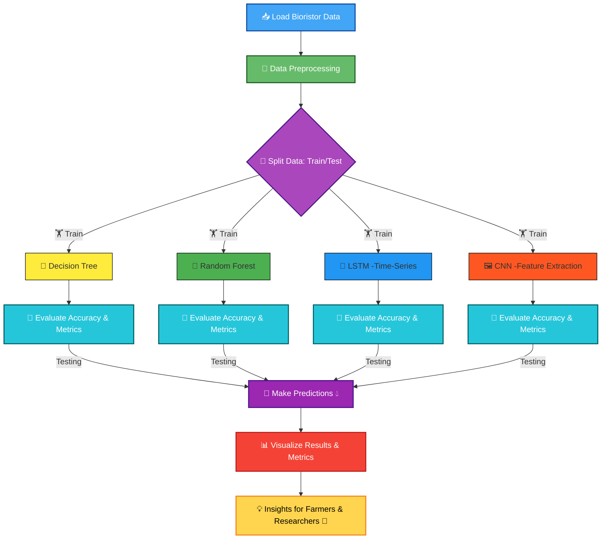

  

This project predicts and forecasts water stress in tomato plants using Bioristor sensor data. 🌿It combines Decision Tree, Random Forest, LSTM, and CNN for accurate classification and forecasting. 🤖 An interactive Streamlit web app provides visual insights for farmers and researchers. 👩‍🌾

## 🔗 Live Demo  

🚀 Visit <strong>Water Stress Prediction WebApp</strong>

  

---

## ✨ Key Highlights  
✔️ Forecasts drought stress in tomato plants using 🌿 **Bioristor sensor data**  
✔️ Implements **Decision Tree, Random Forest, LSTM, and CNN**  
✔️ Provides **visual insights for farmers & researchers** 👩‍🌾  
✔️ Interactive **Streamlit web app** for real-time prediction  

---

## 📌 Project Workflow  

### 🔵 Step 1: Importing Libraries  
📥 **Importing necessary libraries**  
`TensorFlow` • `Keras` • `Scikit-learn` • `Pandas` • `NumPy` • `Matplotlib`  

### 🟢 Step 2: Data Preparation  
🧹 **Loading & Preprocessing Dataset**  
- Scaling features  
- Splitting into training & testing sets

### 🟣 Step 3: Model Training & Evaluation  
🏋️ **Training & Evaluating Models**  
- ML: 🌳 Decision Tree, 🌲 Random Forest  
- DL: 🔄 LSTM, 🖼️ CNN  
- Metrics: ✅ Accuracy • 📉 Confusion Matrix • 🎯 F1-score  

### 🟠 Step 4: Predictions  
🔮 **Making Predictions**  
- Forecast drought conditions 🌦️  
- Recommend irrigation schedules 💧  

### 🔺 Step 5: Visualization  
📊 **Visualization of Results**  
- Charts 📈  
- Plots 📉  
- Performance comparison ⚖️  

### 🟡 Step 6: Insights & Recommendations  
💡 **Feature Insights**  
- Actionable recommendations for farmers 👨‍🌾👩‍🌾  
- Research support 🌱  
- Decision support for irrigation and water management 🚜💧  

---

## 🛠️ Requirements

---
## 📊 Dataset
The application works with **Bioristor sensor data** collected from tomato plants.  
Example CSV format:
| feature1 | feature2 | ... | status | y |
|----------|----------|-----|-------|---|
| 0.12     | 0.85     | ... | Healthy | 0 |
| 0.09     | 0.70     | ... | Stressed| 1 |

- **`status`** → Plant health status (**Healthy, Uncertainty, Recovery, Stress**).  
- **`y`** → Drought condition (**0 = No Drought**, **1 = Drought**).  

---

## 🌟 Features
✨ Upload CSV datasets for training and testing.  
✨ Automatic **data preprocessing** (missing value handling & normalization).  
✨ Train and evaluate multiple ML algorithms:
   - 🌳 **Decision Tree**
   - 🌲 **Random Forest**
   - 🔄 **LSTM (Long Short Term Memory)**  
   - 🖼️ **CNN (Convolutional Neural Network)**
✨ Interactive **performance metrics** and **visualizations** 📊 (Bar Charts & Tables).
✨ Predict drought status for **new sensor data** in real-time.

---
## 📈 Machine Learning & Deep Learning Models
| 🌟 Model                     | ⚡ Description                                   |
|-------------------------------|-------------------------------------------------|
| 🌳 Decision Tree  | Simple classifier based on tree splitting rules. |
| 🌲 Random Forest             | Ensemble of decision trees for higher accuracy. |
| 🔄 LSTM                      | Recurrent neural network for sequential/time-series sensor data. |
| 🖼️ CNN                       | Convolutional neural network for feature extraction from sensor patterns. |

---

## 🛠️ Tech Stack
- 🐍 **Programming Language:** Python 
- 🎯 **Frontend:** Streamlit  
- 🤖 **ML & DL :** DecisionTree, RandomForest, LSTM, CNN
- 📚 **Libraries:** Pandas, NumPy, Matplotlib ,Scikit-learn,Tensorflow   

## 🏆 Results  
- ✅ High accuracy achieved across ML/DL models  
- ✅ LSTM 🔄 & CNN 🖼️ improved performance on time-series forecasting  
- ✅ Visualization shows clear stress patterns in tomato plants 🌱  
- ✅ Helps farmers & researchers optimize irrigation 💧  

## 🖼️ Web App Screenshots
🏠 Home Page – Upload New Data & Preprocessing   

🔮 Predictions – Drought status for New data  

---

## 🔮 Future Improvements
- 🚀 Integrate real-time IoT sensor feeds for live predictions.  
- 📈 Enhance time-series forecasting with hybrid **CNN-LSTM models**.  
- 📊 Add **Power BI/Excel dashboards** for farmer-friendly analytics.  
- 🔥 Integrate **more advanced deep learning models** like GRU or Transformer for better forecasting.

---

## 🗂️ Project Workflow Diagram

## 👨‍💻 Author  

**Lomada Siva Gangi Reddy**  
- 🎓 B.Tech CSE (Data Science), RGMCET (2021–2025)  
- 💡 Interests: Python | Machine Learning | Deep Learning | Data Science  
- 📍 Open to **Internships & Job Offers**

 **Contact Me**:  

- 📧 **Email**: lomadasivagangireddy3@gmail.com  
- 📞 **Phone**: 9346493592  
- 💼 [LinkedIn](https://www.linkedin.com/in/lomada-siva-gangi-reddy-a64197280/)  🌐 [GitHub](https://github.com/shivareddy2002)  🚀 [Portfolio](https://lsgr-portfolio-pulse.lovable.app/)

---

  

